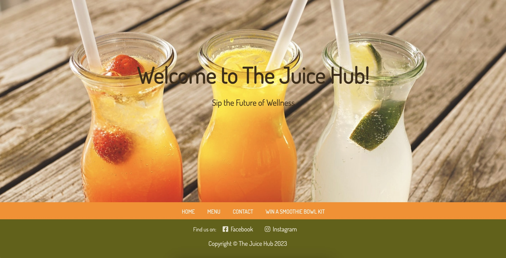
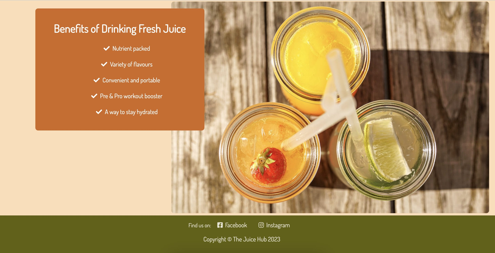
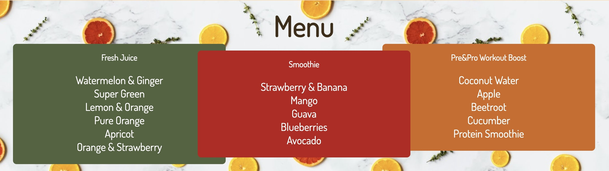
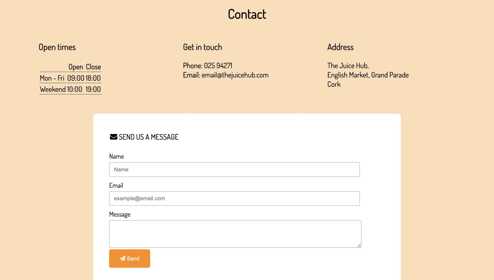
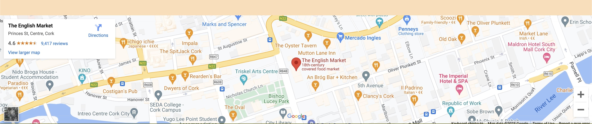

# **THE JUICE HUB**  
## The Juice Hub is a website that showcase my juice shop's menu and services. It provides detailed information of types of juices and other drinks available, why they are beneficial and a special smoothie prize.  

 
  
### The Juice Hub website target demographic is anyone who prioritises their health, well-being and nutrition. This may include individuals who are fitness enthusiast, those with restricted diets, for example, celiacs or lactose intolerants, as well as those who are looking to incorporate more fruits and vegetables in their day to day diet.  

### The website will be useful to the audience as they can see the menu option which will enhance their experience and complete the survey to win a Smoothie Bowl Kit prize. The transparency will build trust with customers who value transparency and quality.  
## Features  

1. **NAVIGATION BAR** 

* It provides users with an intuitive access to the different sections of the website such as Home, Menu, Contact and Win a Smoothie Bowl Kit.  

 

2. **THE LANDING IMAGE PAGE** 

* It captures the essence of our vibrant and refreshing juice options with a captivating image, enticing viewrs to explore the taste and health benefits of our carefully crafted fresh juices and smoothies.  

 

3. **THE BENEFITS OF FRESH JUICE**

* Highlights in short thought provoking statements of the benefits of fresh juices, leading the viewers to ponder over the power of nature: nourishing and energising and encourage them to visit our Juice Hub in person.  

4. **MENU**

* The menu serves as a handy guide, presenting a list of available juice options in a clear and organised manner. Ultimately, the menu enhances the customer's overall juice shop experience by offering a convenient and enjoyable way to discover and choose their favorite juices.  

5. **CONTACT INFORMATION**

* Simple yet vital the contact information section enables customers and visitors to connect with the juice shop. It provides essential details such as phone numbers, email addresses, physical addresses, and opening/closing hours making it convenient for individuals to get in touch. An additional purpose of this section is to ensure customers feel valued, supported, and encouraged to engage further with our juice shop.  

6. **MAP**

* The map helps customers easily locate the physical location of our juice shop. By providing a visual representation of the shop's address and surroundings, the map enables customers to plan their visit and find best routes to reach there.  

7. **FOOTER**

* The footer has our social media links to encourage customers to explore and connect with our shop on various digital channels such as Facebook and Instagram. By clicking on the social media links in the footer, customers can follow our shop's updates, promotions, and special offers on different platforms.  

