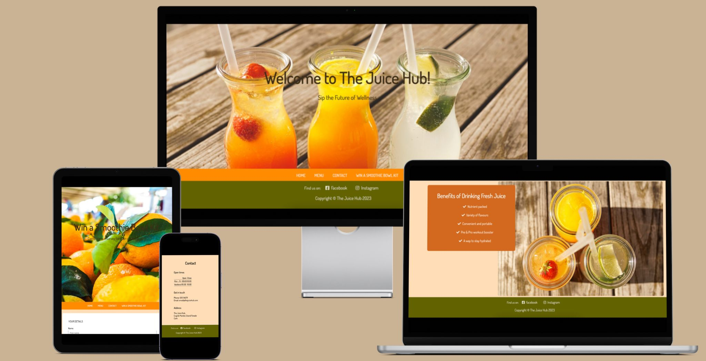

# **THE JUICE HUB**  
## The Juice Hub is a website that showcase my juice shop's menu and services. It provides detailed information of types of juices and other drinks available, why they are beneficial and a special smoothie prize.  

 
  
### The Juice Hub website target demographic is anyone who prioritises their health, well-being and nutrition. This may include individuals who are fitness enthusiast, those with restricted diets, for example, celiacs or lactose intolerants, as well as those who are looking to incorporate more fruits and vegetables in their day to day diet.  

### The website will be useful to the audience as they can see the menu option which will enhance their experience and complete the survey to win a Smoothie Bowl Kit prize. The transparency will build trust with customers who value transparency and quality.  
## Features  
1. Navigation Bar 
* It provides users with an intuitive access to the different sections of the website such as Home, Menu, Contact and Win a Smoothie Bowl Kit.  

 
2. The Landing Page Image  

* It captures the essence of our vibrant and refreshing juice options with a captivating image, enticing viewrs to explore the taste and health benefits of our carefully crafted fresh juices and smoothies.

